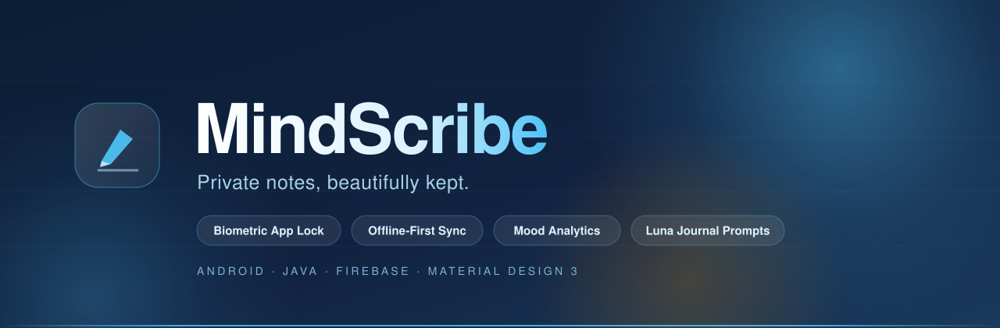
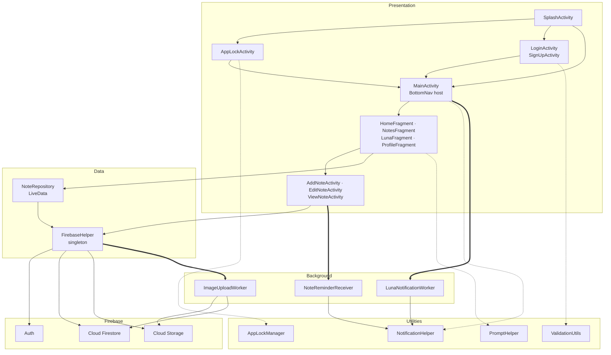
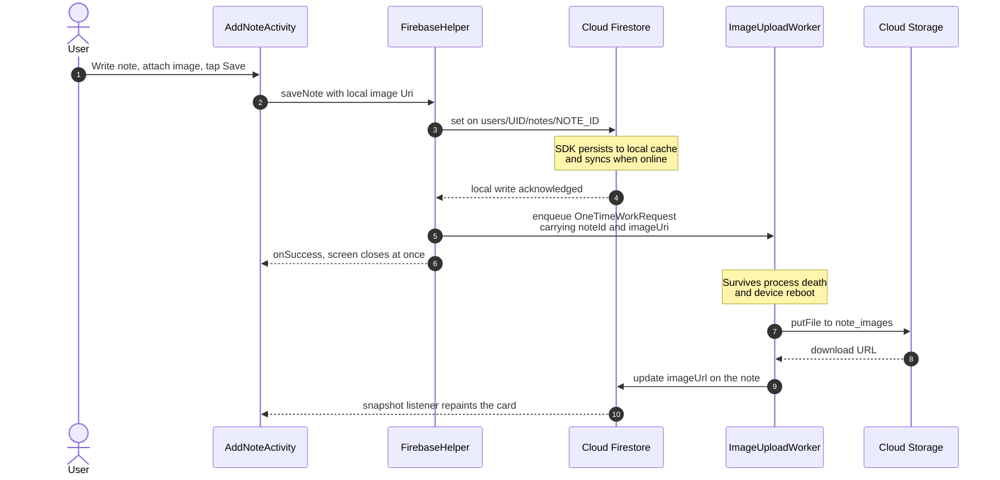
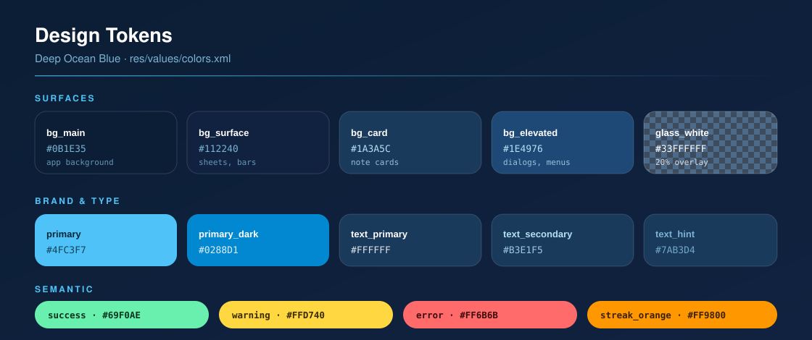

<div align="center">



<br>

**A privacy-first journaling and note-taking app for Android — biometric-locked, offline-capable, and built on a real-time Firebase backend.**

<br>

[](https://developer.android.com)
[](https://docs.oracle.com/javase/8/)
[](https://firebase.google.com)
[](https://m3.material.io)

[](https://developer.android.com/tools/releases/platforms)
[](https://developer.android.com/tools/releases/platforms)
[](https://gradle.org)
[](https://github.com/Ahmadhsn1/MindScribe-android-app/releases/latest)
[](LICENSE)

<br>

### [⬇️ Download APK](https://github.com/Ahmadhsn1/MindScribe-android-app/releases/latest) · [🏗 Architecture](#-architecture) · [🔐 Security Model](#-security-model) · [🚀 Getting Started](#-getting-started)

</div>

<br>

---

## 📖 Overview

**MindScribe** is a native Android journaling app built around a simple conviction: *the things people write down about their own lives deserve to be treated as sensitive data.*

Most note apps stop at CRUD. MindScribe treats privacy, offline resilience, and emotional context as first-class product requirements:

- **Your journal can be locked independently of your phone.** A PIN or fingerprint gate sits in front of journal entries, backed by `EncryptedSharedPreferences` and salted SHA-256 hashing — the PIN itself is never stored, on-device or in the cloud.
- **Writing never blocks on the network.** Notes commit to Firestore's local cache instantly; attached images are handed to `WorkManager`, which survives process death and reboots to finish the upload whenever connectivity returns.
- **Journaling is guided, not blank-page.** *Luna*, the built-in companion, serves a deterministic daily prompt from a curated set and nudges you once a day via a `PeriodicWorkRequest`.
- **Your habits are visible.** A consecutive-day streak counter and a mood distribution donut chart are computed client-side from your own note history.

It is written in **plain Java** with **ViewBinding**, no reactive framework and no dependency-injection container — deliberately, so the data flow stays legible end to end. 25 classes, 3,857 lines.

<br>

## ✨ Feature Set

### Capture

| Feature | Detail |
|:--|:--|
| **Rich note composer** | Title, body, category, mood, and colour theme in a single Material 3 sheet |
| **Voice dictation** | Speech-to-text via `RecognizerIntent.ACTION_RECOGNIZE_SPEECH`, appended into the body |
| **Image attachments** | Picked with `ActivityResultContracts`, uploaded to Cloud Storage, rendered with Glide |
| **One-line mode** | A dedicated fast path for single-sentence entries |
| **Time capsules** | Entries stamped with a future `releaseDate`, written now and meant for later |
| **4 categories** | Personal · Work · Ideas · Important |
| **5 moods** | Happy · Sad · Motivated · Anxious · Calm |
| **5 colour themes** | Default · Sage · Sky · Peach · Rose, applied per note card |

### Organise & Retrieve

| Feature | Detail |
|:--|:--|
| **Real-time list** | Firestore `addSnapshotListener` — edits on one device repaint every other instantly |
| **Unified filtering** | Category chips, a `CalendarView` date range, and free-text search compose into one `applyFilters()` pass rather than fighting each other |
| **Favourites** | Star any note; surfaced as its own chip in the filter row |
| **Reminders** | Per-note alarms via `setExactAndAllowWhileIdle(RTC_WAKEUP)` delivered by a `BroadcastReceiver` |

### Reflect

| Feature | Detail |
|:--|:--|
| **Luna prompts** | 14 curated journaling prompts, selected deterministically as `dayOfYear % 14` so the prompt is stable for a given day |
| **Daily nudge** | `PeriodicWorkRequest` enqueued with `ExistingPeriodicWorkPolicy.KEEP`, so re-launching never stacks duplicates |
| **Writing streak** | Consecutive-day counter tolerant of "haven't written *yet* today" — see [Engineering Decisions](#-engineering-decisions) |
| **Mood analytics** | Animated MPAndroidChart donut over your mood distribution |

### Protect

| Feature | Detail |
|:--|:--|
| **Biometric unlock** | `BiometricPrompt` at `BIOMETRIC_WEAK` with graceful PIN fallback |
| **PIN app lock** | Salted SHA-256, salt from `SecureRandom`, stored in `EncryptedSharedPreferences` (AES256-SIV keys / AES256-GCM values) |
| **Per-note gate** | Opening a `Journal` note re-prompts for the PIN even inside an unlocked session |
| **Owner-only backend** | Firestore and Storage rules committed to this repo — no shared or public data path exists |

<br>

## 🖼 Screens

| Screen | Class | What it does |
|:--|:--|:--|
| Splash | `SplashActivity` | 2,200 ms animated intro; routes to lock screen, home, or login based on session + lock state |
| Sign Up / Login | `SignUpActivity` · `LoginActivity` | Firebase Email/Password auth, validated by `ValidationUtils` |
| App Lock | `AppLockActivity` | Dual-mode — `SETUP` to create a PIN, `UNLOCK` to verify; offers biometrics when enrolled |
| Home | `HomeFragment` | Greeting, streak card, mood donut, recent notes |
| Notes | `NotesFragment` | Full list with chips, calendar, and search |
| Luna | `LunaFragment` | Daily prompt and journaling entry point |
| Profile | `ProfileFragment` | Avatar upload, app-lock toggle, stats, sign out |
| Add / Edit / View | `AddNoteActivity` · `EditNoteActivity` · `ViewNoteActivity` | The note lifecycle, including voice, images, and reminders |

> [!NOTE]
> Screenshots are intentionally omitted rather than mocked up. Install the [signed APK](https://github.com/Ahmadhsn1/MindScribe-android-app/releases/latest) to see the real UI, or build from source in under a minute.

<br>

## 🏗 Architecture

MindScribe uses a pragmatic layered structure. The UI layer never touches Firebase SDKs directly — every read and write funnels through `FirebaseHelper`, a thread-safe singleton, with `NoteRepository` exposing `LiveData` on top of it.



### Offline-first image upload

The part of the codebase I'd point to first. Saving a note with an image does **not** wait on the upload — the note commits locally, the UI returns immediately, and the image reconciles later.



If the worker throws, it returns `Result.retry()` and WorkManager re-runs it under exponential backoff — no lost attachments, no spinner stuck on screen.

<br>

## 📂 Project Structure

```
MindScribe/
├── app/
│   ├── src/main/
│   │   ├── java/com/mindscribe/
│   │   │   ├── activities/            # 8 — splash, auth, lock, host, note lifecycle
│   │   │   │   ├── SplashActivity.java
│   │   │   │   ├── LoginActivity.java
│   │   │   │   ├── SignUpActivity.java
│   │   │   │   ├── AppLockActivity.java
│   │   │   │   ├── MainActivity.java
│   │   │   │   ├── AddNoteActivity.java
│   │   │   │   ├── EditNoteActivity.java
│   │   │   │   └── ViewNoteActivity.java
│   │   │   ├── fragments/             # 4 — the bottom-nav destinations
│   │   │   │   ├── HomeFragment.java
│   │   │   │   ├── NotesFragment.java
│   │   │   │   ├── LunaFragment.java
│   │   │   │   └── ProfileFragment.java
│   │   │   ├── adapters/
│   │   │   │   └── NotesAdapter.java  # filterable RecyclerView adapter
│   │   │   ├── data/repository/
│   │   │   │   └── NoteRepository.java
│   │   │   ├── models/
│   │   │   │   ├── Note.java          # 17 fields, @PropertyName-mapped
│   │   │   │   └── User.java
│   │   │   ├── interfaces/
│   │   │   │   └── NoteClickListener.java
│   │   │   ├── receivers/
│   │   │   │   └── NoteReminderReceiver.java
│   │   │   ├── workers/
│   │   │   │   ├── ImageUploadWorker.java
│   │   │   │   └── LunaNotificationWorker.java
│   │   │   └── utils/
│   │   │       ├── FirebaseHelper.java     # single Firebase gateway
│   │   │       ├── AppLockManager.java     # encrypted PIN + biometrics
│   │   │       ├── NotificationHelper.java # channels + builders
│   │   │       ├── PromptHelper.java       # 14 daily prompts
│   │   │       └── ValidationUtils.java
│   │   ├── res/
│   │   │   ├── layout/                # 14 layouts
│   │   │   ├── drawable/              # 28 vectors, gradients, glass surfaces
│   │   │   ├── anim/                  # 8 transitions
│   │   │   ├── menu/                  # 3 menus
│   │   │   ├── color/
│   │   │   └── values/                # colors · themes · strings · dimens
│   │   └── AndroidManifest.xml
│   ├── build.gradle
│   └── google-services.json.example   # ← copy to google-services.json
├── docs/                              # brand assets, generated from real tokens
├── firestore.rules                    # owner-only, deny-by-default
├── storage.rules                      # signed-in, 8 MB image cap
├── build.gradle · settings.gradle
└── LICENSE
```

<br>

## 🛠 Tech Stack

| Layer | Technology | Version |
|:--|:--|:--|
| **Language** | Java | 8 |
| **Build** | Gradle · Android Gradle Plugin | 8.2.1 · 8.2.0 |
| **SDK** | compileSdk / targetSdk · minSdk | 34 · 24 |
| **Auth** | Firebase Authentication (Email/Password) | BOM 32.7.2 |
| **Database** | Cloud Firestore (real-time listeners, offline cache) | BOM 32.7.2 |
| **Storage** | Cloud Storage | BOM 32.7.2 |
| **Design** | Material Components (Material 3) | 1.11.0 |
| **Encryption** | `androidx.security:security-crypto` | 1.1.0-alpha06 |
| **Biometrics** | `androidx.biometric` | 1.1.0 |
| **Background** | WorkManager | 2.9.0 |
| **Charts** | MPAndroidChart | 3.1.0 |
| **Images** | Glide | 4.16.0 |
| **Animation** | Lottie · Facebook Shimmer | 6.3.0 · 0.5.0 |
| **UI** | AppCompat · ConstraintLayout · RecyclerView · Fragment | 1.6.1 · 2.1.4 · 1.3.2 · 1.6.2 |
| **Misc** | CircleImageView | 3.1.0 |

<br>

## 🗄 Data Model

Every user owns a private document tree. There is no shared collection anywhere in the schema.

```
users/{uid}
   ├── userId            String
   ├── name              String
   ├── email             String
   ├── profileImageUrl   String
   ├── createdAt         Timestamp
   │
   └── notes/{noteId}
         ├── noteId          String
         ├── title           String
         ├── content         String
         ├── category        String     # Personal | Work | Ideas | Important | Journal
         ├── mood            String     # Happy | Sad | Motivated | Anxious | Calm
         ├── colorTheme      String     # Default | Sage | Sky | Peach | Rose
         ├── imageUrl        String     # filled in later by ImageUploadWorker
         ├── reminderTime    long       # epoch millis, 0 when unset
         ├── isFavorite      boolean
         ├── createdAt       Timestamp
         ├── updatedAt       Timestamp
         ├── journalDate     Timestamp
         ├── promptId        String     # links the entry to its Luna prompt
         ├── isTimeCapsule   boolean
         ├── releaseDate     Timestamp
         ├── isOneLine       boolean
         └── isLocked        boolean
```

Boolean fields carry explicit `@PropertyName` annotations, because Firestore's default POJO mapper would otherwise serialise `isFavorite()` to a `favorite` key and silently break round-tripping.

**Cloud Storage layout**

```
profile_images/{uid}.jpg          # one avatar per user, filename-locked to the owner
note_images/{timestamp}.jpg       # note attachments
```

<br>

## 🔐 Security Model

> [!IMPORTANT]
> This repository ships **no credentials**. `app/google-services.json` is gitignored; a placeholder `google-services.json.example` is committed in its place. Supply your own Firebase project — see [Getting Started](#-getting-started).

**PIN storage.** The PIN is never persisted. `AppLockManager` generates a 16-byte salt from `SecureRandom`, hashes `salt + ":" + pin` with SHA-256, and writes only salt and digest:

```java
String masterKeyAlias = MasterKeys.getOrCreate(MasterKeys.AES256_GCM_SPEC);
prefs = EncryptedSharedPreferences.create(
        PREFS_NAME, masterKeyAlias, context.getApplicationContext(),
        EncryptedSharedPreferences.PrefKeyEncryptionScheme.AES256_SIV,
        EncryptedSharedPreferences.PrefValueEncryptionScheme.AES256_GCM);
```

The master key lives in the Android Keystore, so the preference file is worthless if lifted off the device.

**Layered access.**

| Layer | Control |
|:--|:--|
| Device | Optional lock gate on cold start, before any note is queryable |
| Session | `BiometricPrompt` at `BIOMETRIC_WEAK`, PIN fallback always available |
| Per-note | `Journal` notes re-prompt for the PIN even mid-session |
| Transport | HTTPS via the Firebase SDKs |
| Backend | Owner-only Firestore rules; deny-by-default on every unmatched path |

**Committed rules.** Backend policy is version-controlled next to the client, not left to console drift:

```javascript
// firestore.rules — owner-only, deny by default
match /users/{userId} {
  allow read, write: if isOwner(userId);
  match /{document=**} { allow read, write: if isOwner(userId); }
}
match /{document=**} { allow read, write: if false; }
```

**Manifest surface.** `SplashActivity` is the only exported component. Permissions are requested narrowly — `READ_EXTERNAL_STORAGE` is capped at `maxSdkVersion="32"` and superseded by `READ_MEDIA_IMAGES` on Android 13+.

<br>

## ⚙️ Background Work

| Job | Mechanism | Trigger | Guarantee |
|:--|:--|:--|:--|
| Image upload retry | `OneTimeWorkRequest` | Note saved with an image while offline | Survives process death and reboot; `Result.retry()` with backoff |
| Daily Luna nudge | `PeriodicWorkRequest` (1 day) | App launch, via `enqueueUniquePeriodicWork` | `ExistingPeriodicWorkPolicy.KEEP` prevents duplicate stacking |
| Note reminder | `AlarmManager` + `BroadcastReceiver` | User-set time on a note | `setExactAndAllowWhileIdle(RTC_WAKEUP)` fires through Doze |

Notification channels are registered once in `MainActivity.onCreate()` through `NotificationHelper.createNotificationChannels(this)`.

<br>

## 🎨 Design System

A single dark theme — *Deep Ocean Blue* — with layered translucent surfaces for a glassmorphic feel. All tokens are centralised in `res/values/colors.xml`; the sheet below is generated from those exact values.

<div align="center">

</div>

Shared component styles live in `themes.xml` rather than being duplicated across the 14 layouts: `MindScribe.TextInputLayout` (18 dp corners), `MindScribe.Button.Primary` (56 dp min height for comfortable touch targets), `MindScribe.Card` (22 dp corners), plus `MindScribe.FAB`, `.BottomNav`, `.Dialog`, and `.Chip`.

<br>

## 🚀 Getting Started

### Prerequisites

- Android Studio **Hedgehog (2023.1.1)** or newer
- JDK **17** (to run Gradle 8.2.1; the app itself targets Java 8 bytecode)
- Android SDK **34**
- A Google account, for a free Firebase project

### 1 · Clone

```bash
git clone https://github.com/Ahmadhsn1/MindScribe-android-app.git
```

### 2 · Create a Firebase project

1. Open the [Firebase Console](https://console.firebase.google.com) and create a project.
2. Add an **Android** app with package name `com.mindscribe`.
3. Enable **Authentication → Sign-in method → Email/Password**.
4. Create a **Cloud Firestore** database.
5. Enable **Cloud Storage**.

### 3 · Wire up your config

Download `google-services.json` from the Firebase Console and drop it at `app/google-services.json`. The committed example shows the expected shape:

```bash
cp app/google-services.json.example app/google-services.json
```

> [!WARNING]
> The real `app/google-services.json` is gitignored on purpose. Never commit it — the example file is the only version that belongs in version control.

### 4 · Deploy the security rules

Ship the rules from this repo instead of leaving the defaults in place:

```bash
firebase deploy --only firestore:rules,storage
```

### 5 · Build and run

```bash
./gradlew installDebug
```

<br>

## 🧰 Build Commands

```bash
./gradlew assembleDebug      # debug APK
./gradlew assembleRelease    # release APK
./gradlew installDebug       # build and install on the connected device
./gradlew lint               # Android Lint report
./gradlew clean              # clear build outputs
```

<br>

## 📊 By the Numbers

<div align="center">

| | |
|:--:|:--:|
| **25** <br> Java classes | **3,857** <br> lines of Java |
| **8** <br> activities | **4** <br> fragments |
| **14** <br> XML layouts | **28** <br> drawables |
| **3** <br> Firebase services | **2** <br> WorkManager workers |
| **14** <br> Luna prompts | **8** <br> transition animations |

</div>

<br>

## 🧠 Engineering Decisions

<details>
<summary><b>Why a streak counter that tolerates "not yet today"</b></summary>

<br>

A naive streak breaks the moment you check the app in the morning before writing. `HomeFragment.calculateCurrentStreak()` starts at today, counts it only if an entry exists, then walks backwards regardless:

```java
if (writtenDays.contains(dayKey(cursor.getTime()))) {
    streak++;
    cursor.add(Calendar.DAY_OF_YEAR, -1);
} else {
    cursor.add(Calendar.DAY_OF_YEAR, -1);
}
while (writtenDays.contains(dayKey(cursor.getTime()))) {
    streak++;
    cursor.add(Calendar.DAY_OF_YEAR, -1);
}
```

So a 9-day streak still reads *9* at 8 a.m., and becomes *10* once you write. Days are bucketed by a `yyyyMMdd` key with `Locale.US` so formatting never varies by device locale.

</details>

<details>
<summary><b>Why one <code>applyFilters()</code> instead of three filter paths</b></summary>

<br>

Category chips, calendar date range, and text search are independent inputs to the same derived list. Implemented separately, each would clobber the others — pick a category, and the active search silently resets.

`NotesFragment.applyFilters()` runs all three as one ordered pass: category (including the synthetic *Favorites* chip) narrows the set, the `CalendarView` range narrows it further, then search is delegated to `adapter.filter()`. Any input can change at any time and the result stays consistent.

</details>

<details>
<summary><b>Why <code>FirebaseHelper</code> is a double-checked singleton</b></summary>

<br>

Fragments, activities, and workers all need the same Firebase gateway, and workers run off the main thread — so construction has to be safe under concurrency without paying for synchronisation on every access:

```java
private static volatile FirebaseHelper instance;

public static FirebaseHelper getInstance(Context context) {
    if (instance == null) {
        synchronized (FirebaseHelper.class) {
            if (instance == null) instance = new FirebaseHelper(context);
        }
    } else if (context != null && instance.context == null) {
        instance.context = context.getApplicationContext();
    }
    return instance;
}
```

`volatile` prevents the partially-constructed-object hazard the classic broken lazy-init suffers from. Only `getApplicationContext()` is ever retained, so no Activity is leaked.

</details>

<details>
<summary><b>Why create and update share one save path</b></summary>

<br>

`performFirestoreSave()` branches on whether `noteId` is empty rather than exposing separate `create` and `update` methods. Callers just say "save this note," which keeps `AddNoteActivity` and `EditNoteActivity` from duplicating field-mapping logic that would inevitably drift as the model grew past a dozen fields.

</details>

<details>
<summary><b>Why listeners are removed in <code>onDestroyView()</code></b></summary>

<br>

`NotesFragment` holds a Firestore `addSnapshotListener` registration and calls `firestoreListener.remove()` in `onDestroyView()`. Without it, rotating the device or navigating tabs leaks a listener holding a reference to a dead view hierarchy — the classic Android memory leak, and a source of `IllegalStateException` when a callback fires after teardown. `SplashActivity` does the equivalent with `handler.removeCallbacksAndMessages(null)`.

</details>

<br>

## 🗺 Roadmap

Known limitations, stated plainly, with the fix each one needs.

| # | Item | Why it matters | Plan |
|:--|:--|:--|:--|
| 1 | `note_images/` is a flat namespace keyed by timestamp | Storage rules can only enforce *authenticated*, not *owner* | Migrate to `note_images/{uid}/{noteId}.jpg` for true per-owner isolation |
| 2 | `NotesAdapter` calls `notifyDataSetChanged()` | Rebinds every row; no item animations | Move to `DiffUtil` / `ListAdapter` |
| 3 | `Theme.MindScribe` extends `Theme.Material3.Light.NoActionBar` | Light parent under a dark palette; some framework widgets inherit wrong defaults | Switch to a `.Dark` parent and add a real `values-night` variant |
| 4 | No automated tests | Streak maths, validation, and PIN hashing are all unit-testable | JUnit for utils, Espresso for the note lifecycle |
| 5 | `minifyEnabled false` on release | Larger APK, no obfuscation | Enable R8 with tuned `proguard-rules.pro` |
| 6 | Email/Password only | Higher signup friction | Add Google Sign-In |
| 7 | Time capsules store `releaseDate` but don't yet enforce it | Feature is half-wired | Gate the note body until the release date, and notify on unlock |

<br>

## 🎓 Academic Context

Built as the semester project for **Mobile Application Development (CS02310)**, Section T, Spring 2026 — *University of Lahore*.

The brief asked for a functional Android CRUD app. This submission goes considerably past that: encrypted local storage, biometric authentication, offline-first sync with background reconciliation, version-controlled backend security rules, and a documented design system.

<br>

## 📄 License

Released under the **MIT License** — see [LICENSE](LICENSE) for the full text.

<br>

## 👤 Author

<div align="center">

**Ahmad Hassan**

[](https://github.com/Ahmadhsn1)

<br>

If MindScribe gave you an idea worth borrowing, a ⭐ is always welcome.

<br>

<sub>Built with Java, Firebase, and a real concern for other people's private notes.</sub>

</div>
